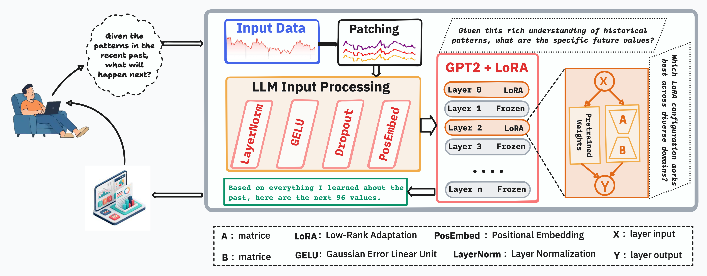

# UnifiedLLM: Parameter-Efficient Fine-Tuning of Large Language Models for Time Series Forecasting: A Systematic Study of LoRA Configurations and Strategies

[](https://opensource.org/licenses/MIT)
[](https://www.python.org/downloads/)
[](https://ieee.org)

> [!CAUTION]
> **Note**: This repository will be made publicly available upon publication in (journal to be determined).

## 📖 Overview



**UnifiedLLM (ULLM)** is a parameter-efficient framework for multi-domain time series forecasting using **distributed LoRA (Low-Rank Adaptation)** fine-tuning of Large Language Models. When deploying LLM-based forecasting systems, ULLM answers the critical question: ***What is the optimal balance between parameter efficiency and model adaptation?***

### The Problem

LLM-based time series forecasting faces a fundamental dilemma:
- 🔒 **Frozen LLMs** (6.52% trainable): Maximum efficiency but limited adaptation
- ⚖️ **Parameter-Efficient Fine-Tuning** (LoRA, ~30% trainable): Balance efficiency and adaptation
- 🔓 **Full Fine-Tuning** (100% trainable): Maximum flexibility but risks overfitting and high computational cost

**Critical questions for practitioners:**
- Does selective LoRA fine-tuning generalize across datasets?
- Can parameter-efficient LoRA match full fine-tuning performance?
- How do hyperparameters (learning rate, patch size, layer selection) affect stability?
- Do larger LLM backbones improve forecasting accuracy?

### The Solution

UnifiedLLM treats LLM layers as **strategic tuning points**, using **distributed LoRA** to selectively fine-tune 6 evenly-spaced layers (0, 2, 4, 6, 8, 10) while freezing intermediate layers. Through systematic empirical study across diverse forecasting domains, ULLM provides:

✅ **Parameter Efficiency Validated**: 29.5% trainable parameters match 70.4% full fine-tuning (2.4× efficiency, only 0.1% MSE loss)
✅ **Domain-Specific Insights**: Optimal configurations vary dramatically by dataset characteristics
✅ **Actionable Guidelines**: Evidence-based tuning recommendations for practitioners

---

## 🎯 Key Findings

### 1. Parameter Efficiency: 2.4× Reduction with Minimal Loss

| Configuration | Trainable Params | Avg MSE | Performance Gap |
|--------------|------------------|---------|-----------------|
| **ULLM-Baseline (LoRA)** | **29.5%** | 0.6900 | Baseline |
| **ULLM-FullFT** | **70.4%** | 0.6891 | **-0.1%** (negligible) |

**Insight**: LoRA achieves **2.4× parameter efficiency** with virtually identical performance to full fine-tuning.

### 2. No Universal Optimal Configuration

| Dataset | Best Config | MSE | Optimization Strategy |
|---------|------------|-----|----------------------|
| **ETTh1 (Electricity)** | **HighLR** (LR=0.001) | 0.5268 | **Higher learning rate** for short-term patterns |
| **Electricity Load** | **LargePatch** (patch=48) | 0.2059 | **Larger patches** for long-term dependencies |
| **Italy Air Quality** | **FullFT** (70% trainable) | 1.1940 | **Full fine-tuning** for noisy environmental data |
| **PEMS Traffic** | **GPT2Med** (355M params) | 0.8150 | **Larger model** for complex spatial-temporal patterns |

**Insight**: Dataset characteristics dictate optimal configuration. One-size-fits-all approaches fail.

### 3. SOTA Comparison: Performance-Efficiency Trade-off

| Method | Best MSE | Trainable Params | Trade-off |
|--------|----------|------------------|-----------|
| **TimeLLM** | 0.4305 (ETTh1) | Higher | **12-22% better accuracy**, higher cost |
| **GPT4TS** | 0.1596 (Electricity) | Higher | **22-29% better accuracy**, higher cost |
| **ULLM-Baseline** | 0.5268 / 0.2059 | **29.5%** | **2.4× parameter efficiency**, competitive |

**Insight**: ULLM provides competitive performance with significantly higher efficiency—ideal for resource-constrained deployments (edge devices, multi-tenant systems, rapid prototyping).

### 4. Configuration Stability Matters

| Configuration | Cross-Dataset Std | Stability |
|--------------|-------------------|-----------|
| **ULLM-Baseline** | 0.418 | ⭐⭐⭐ Most stable |
| **ULLM-FullFT** | 0.419 | ⭐⭐⭐ Most stable |
| **ULLM-HighLR** | 0.444 | ⭐⭐ Higher variance |
| **ULLM-LargePatch** | 0.445 | ⭐⭐ Higher variance |

**Insight**: Baseline LoRA and full fine-tuning show most consistent cross-dataset performance. Hyperparameter variants trade stability for peak performance.

---

## 🚀 Quick Start

### Installation

```bash
# Clone repository (available after publication)
git clone https://github.com/hosei-university-iist-yulab/uLLM.git
cd uLLM

# Install dependencies
pip install -r requirements.txt

# Install PyPOTS (provides baseline implementations)
pip install pypots
```

### Run Experiments

```bash
# 7 ULLM configurations × 4 datasets = 28 experiments
python experiments/run_all_experiments.py

# Specific configuration
python experiments/run_baseline.py --dataset ETTh1
python experiments/run_high_lr.py --dataset Electricity
python experiments/run_large_patch.py --dataset ItalyAir
```

### Quick Demo

```python
from ullm import UnifiedLLM

# Initialize baseline LoRA configuration
model = UnifiedLLM(
    backbone='gpt2',           # GPT-2 base (124M params)
    lora_layers=6,             # Distributed: [0,2,4,6,8,10]
    lora_rank=8,               # Low-rank dimension
    patch_size=16,             # Patch tokenization
    learning_rate=1e-4
)

# Train on your time series data
model.fit(X_train, y_train)

# Forecast
predictions = model.predict(X_test)
```

---

## 📊 Methodology

### Distributed LoRA Strategy

UnifiedLLM applies LoRA to **6 evenly-spaced layers** (0, 2, 4, 6, 8, 10) while freezing intermediate layers (1, 3, 5, 7, 9, 11):

```
GPT-2 (12 Transformer Layers)
├─ Layer 0  [LoRA ✓] ← Trainable
├─ Layer 1  [Frozen] ← Fixed
├─ Layer 2  [LoRA ✓] ← Trainable
├─ Layer 3  [Frozen] ← Fixed
├─ Layer 4  [LoRA ✓] ← Trainable
├─ Layer 5  [Frozen] ← Fixed
├─ Layer 6  [LoRA ✓] ← Trainable
├─ Layer 7  [Frozen] ← Fixed
├─ Layer 8  [LoRA ✓] ← Trainable
├─ Layer 9  [Frozen] ← Fixed
├─ Layer 10 [LoRA ✓] ← Trainable
└─ Layer 11 [Frozen] ← Fixed

Result: 29.5% trainable parameters
```

**Why distributed?** Ablation studies show evenly-spaced LoRA layers outperform concentrated approaches (first/last layers only).

### Pipeline Architecture


**Figure 1**: UnifiedLLM architecture showing the complete pipeline from input data to forecasted predictions, featuring distributed LoRA fine-tuning across alternating GPT-2 layers.

```
Input Time Series (X ∈ ℝ^(96×D))
    ↓
[Patch Tokenization] Conv1D(kernel=16, stride=16)
    ↓ 6 patches
[Input Preprocessing] LayerNorm → GELU → Dropout → PosEmbed
    ↓ d_m=768
[GPT-2 + Distributed LoRA] 12 layers, 6 with LoRA adapters
    ↓ Hidden states
[Forecasting Head] MeanPooling → Linear(768 → D)
    ↓
Predictions (Ŷ ∈ ℝ^(96×D))
```

### Seven Configurations Tested

| Config | Description | LR | Patch | Layers | Trainable % |
|--------|-------------|-----|-------|--------|-------------|
| **Baseline** | Standard LoRA | 1e-4 | 16 | 6 (LoRA) | 29.5% |
| **FullFT** | Full fine-tuning | 1e-4 | 16 | 12 (All) | 70.4% |
| **HighLR** | 10× higher LR | 1e-3 | 16 | 6 (LoRA) | 29.5% |
| **LargePatch** | 3× larger patches | 1e-4 | 48 | 6 (LoRA) | 30.0% |
| **GPT2Med** | Larger backbone | 1e-4 | 16 | 6 (LoRA) | 30.0% |
| **MoreLayers** | All-layer LoRA | 1e-4 | 16 | 12 (LoRA) | 46.0% |
| **Combined** | High LR + Large Patch + 12 LoRA | 1e-3 | 48 | 12 (LoRA) | 46.0% |

---

## 📚 Datasets

UnifiedLLM is evaluated on **4 diverse real-world time series domains**:

| Dataset | Domain | Features | Samples | Horizon | Complexity |
|---------|--------|----------|---------|---------|------------|
| **ETTh1** | Electricity Transformer Temperature | 7 | 17,420 | 96 | Short-term power patterns |
| **Electricity Load** | Household Power Consumption | 370 | 26,304 | 96 | Long-term consumption trends |
| **Italy Air Quality** | Environmental Pollution Sensors | 5 | 17,544 | 96 | Noisy environmental data |
| **PEMS Traffic** | Highway Sensor Network | 862 | 52,116 | 96 | Complex spatial-temporal |

**Total**: 28 experiments (7 configs × 4 datasets) + SOTA baselines

---

## 🔬 Experiments & Results

### Experiment Setup

- **7 Configurations**: Baseline + 6 variants (FullFT, HighLR, LargePatch, GPT2Med, MoreLayers, Combined)
- **4 Datasets**: ETTh1, Electricity Load, Italy Air Quality, PEMS Traffic
- **Metrics**: MSE (primary), MAE, RMSE
- **Hardware**: Single RTX 3090 (24GB)
- **Training Time**: 3-7 minutes per experiment

### Main Results (MSE ↓ Lower is Better)

| Configuration | ETTh1 | Electricity | Italy Air | PEMS | **Average** |
|--------------|-------|-------------|-----------|------|-------------|
| **Baseline** | 0.5312 | 0.2141 | 1.1958 | 0.8187 | **0.6900** |
| **FullFT** | 0.5372 | 0.2075 | **1.1940** ✓ | 0.8175 | **0.6891** |
| **HighLR** | **0.5268** ✓ | 0.2093 | 1.2492 | 0.8506 | 0.7090 |
| **LargePatch** | 0.5346 | **0.2059** ✓ | 1.2480 | 0.8381 | 0.7048 |
| **GPT2Med** | 0.5292 | 0.2093 | 1.2295 | **0.8150** ✓ | 0.6958 |
| **MoreLayers** | 0.5338 | 0.2079 | 1.2110 | 0.8197 | 0.6931 |
| **Combined** | 0.5458 | 0.2165 | 1.2264 | 0.8235 | 0.7031 |

✓ = Best configuration for that dataset

### SOTA Comparison

| Method | ETTh1 MSE | Electricity MSE | Trainable % | Gap to ULLM |
|--------|-----------|-----------------|-------------|-------------|
| **TimeLLM** | **0.4305** | OOM (failed) | Higher | -18% (better) |
| **GPT4TS** | 0.5012 | **0.1596** | Higher | -22% to -29% (better) |
| **ULLM-Best** | 0.5268 | 0.2059 | **29.5%** | Baseline (efficient) |

**Trade-off Analysis**:
- SOTA methods: 12-29% better accuracy, higher computational cost
- ULLM: Competitive performance, 2.4× parameter efficiency

---

## 🛠️ Technical Stack

- **Language**: Python 3.8+
- **Deep Learning**: PyTorch 2.0+
- **LLM Backbone**: HuggingFace Transformers (GPT-2, GPT-2 Medium)
- **PEFT**: LoRA via HuggingFace PEFT library
- **Time Series Library**: PyPOTS (baseline implementations)
- **Evaluation**: Custom metrics (MSE, MAE, RMSE)
- **Visualization**: Matplotlib, Seaborn

---

## 📄 Citation

If you use UnifiedLLM in your research, please cite our paper (journal to be determined):

```bibtex
@article{Messou2025UnifiedLLM,
  author={Messou, Franck Junior Aboya and Chen, Jinhua and Wang, Weiyu and Tao, Yu and Tolba, Amr and Alfarraj, Osama and Yu, Keping},
  journal={IEEE Transactions (To Be Determined)},
  title={Parameter-Efficient Fine-Tuning of Large Language Models for Time Series Forecasting: A Systematic Study of LoRA Configurations and Strategies},
  year={2025},
  note={Under Review}
}
```

**Preprint**: Available soon on arXiv

---

## 📚 Related Publications by Authors

#### 2025

<details>
<summary><b>[VTC2025-Spring]</b> Federated Fine-Tuning of Large Language Models for Intelligent Automotive Systems with Low-Rank Adaptation</summary>

```bibtex
@INPROCEEDINGS{Chen2025FedLLM,
  author={Chen, Jinhua and Messou, Franck Junior Aboya and Zhang, Shilong and Liu, Tong and Yu, Keping and Niyato, Dusit},
  booktitle={2025 IEEE 101st Vehicular Technology Conference (VTC2025-Spring)},
  title={Federated Fine-Tuning of Large Language Models for Intelligent Automotive Systems with Low-Rank Adaptation},
  year={2025},
  month={Jun},
  address={Oslo, Norway},
  doi={10.1109/VTC2025-Spring65109.2025.11174441}
}
```
</details>

<details>
<summary><b>[ICUFN 2025]</b> TSFormer: Temporal-Aware Transformer for Multi-Horizon Forecasting</summary>

```bibtex
@INPROCEEDINGS{Messou2025TSFormer,
  author={Messou, Franck Junior Aboya and Chen, Jinhua and Liu, Tong and Zhang, Shilong and Yu, Keping},
  booktitle={2025 Sixteenth International Conference on Ubiquitous and Future Networks (ICUFN)},
  title={TSFormer: Temporal-Aware Transformer for Multi-Horizon Forecasting with Learnable Positional Encodings and Attention Mechanisms},
  year={2025},
  month={Jul},
  address={Lisbon, Portugal},
  doi={10.1109/ICUFN65838.2025.11170021}
}
```
</details>

<details>
<summary><b>[Preprint]</b> Spec2LLM: Spectral Reprogramming for Frozen LLM Forecasting</summary>

```bibtex
@article{Messou2024Spec2LLM,
  author={Messou, Franck Junior Aboya and Chen, Jinhua and Wang, Weiyu and Tao, Yu and Yu, Keping},
  title={Spec2LLM: A Spectral-to-Language Reprogramming Framework for Power Load Forecasting with Frozen Large Language Models},
  journal={ResearchGate Preprint},
  year={2024},
  note={Available: https://www.researchgate.net/publication/396703425}
}
```
</details>

<details>
<summary><b>[CCNC 2025]</b> Enhancing Federated Learning with Decoupled Knowledge Distillation</summary>

```bibtex
@INPROCEEDINGS{Chen2025FedKD,
  author={Chen, Jinhua and Zhang, Shilong and Liu, Tong and Messou, Franck Junior Aboya and Yu, Keping},
  booktitle={2025 IEEE 22nd Consumer Communications \& Networking Conference (CCNC)},
  title={Enhancing Federated Learning in Consumer Electronics with Decoupled Knowledge Distillation against Data Poisoning},
  year={2025},
  month={Jan},
  doi={10.1109/CCNC54725.2025.10976151}
}
```
</details>

#### 2024

<details>
<summary><b>[VTC2024-Fall]</b> Byzantine-Fault-Tolerant Federated Learning for IoV</summary>

```bibtex
@INPROCEEDINGS{Chen2024Byzantine,
  author={Chen, Jinhua and Zhao, Zihan and Messou, Franck Junior Aboya and Katabarwa, Robert and Alfarraj, Osama and Yu, Keping and Guizani, Mohsen},
  booktitle={2024 IEEE 100th Vehicular Technology Conference (VTC2024-Fall)},
  title={A Byzantine-Fault-Tolerant Federated Learning Method Using Tree-Decentralized Network and Knowledge Distillation for Internet of Vehicles},
  year={2024},
  month={Oct},
  address={Washington, DC, USA},
  doi={10.1109/VTC2024-Fall63153.2024.10757805}
}
```
</details>

<details>
<summary><b>[VTC2024-Fall]</b> Short-Term Load Forecasting with CNN-BiLSTM</summary>

```bibtex
@INPROCEEDINGS{Messou2024LoadForecasting,
  author={Messou, Franck Junior Aboya and Chen, Jinhua and Katabarwa, Robert and Zhao, Zihan and Yu, Keping},
  booktitle={2024 IEEE 100th Vehicular Technology Conference (VTC2024-Fall)},
  title={Enhancing Short-Term Load Forecasting in Internet of Things: A Hybrid Attention-based CNN-BiLSTM with Data Augmentation Approach},
  year={2024},
  month={Oct},
  address={Washington, DC, USA},
  doi={10.1109/VTC2024-Fall63153.2024.10757868}
}
```
</details>

---

## 👥 Authors & Affiliations

**Franck Junior Aboya Messou** (Lead Author, Corresponding Author)
Graduate School of Science and Engineering, Hosei University, Tokyo 184-8584, Japan
📧 franckjunioraboya.messou@ieee.org | franckjunioraboya.messou.3n@stu.hosei.ac.jp

[ResearchGate](https://www.researchgate.net/profile/Franck-Junior-Aboya-Messou) | [IEEE Xplore](https://ieeexplore.ieee.org/author/274956027119414) | [Google Scholar](https://scholar.google.ca/scholar?hl=fr&as_sdt=0%2C5&q=franck+junior+aboya+messou&btnG=)

**Jinhua Chen, Weiyu Wang, Yu Tao, Keping Yu**
Graduate School of Science and Engineering, Hosei University, Tokyo 184-8584, Japan
📧 {jinhua.chen, wang.weiyu, yu.tao, keping.yu}@ieee.org

**Amr Tolba, Osama Alfarraj**
Department of Computer Science and Engineering, College of Applied Studies, King Saud University, Riyadh 11437, Saudi Arabia
📧 {amr.tolba, oalfarraj}@ksu.edu.sa

---

## 📜 License

This project is licensed under the MIT License - see the [LICENSE](LICENSE) file for details.

---

## 🙏 Acknowledgments

This research is supervised by **Professor Keping Yu** (Hosei University, Tokyo, Japan / Waseda University, Tokyo, Japan).

**Funding**:
- Ongoing Research Funding Program (ORF-2026-681), King Saud University, Riyadh, Saudi Arabia
- Graduate School of Science and Engineering, Hosei University, Tokyo, Japan

**Implementation**:
- Built upon **PyPOTS** (Python Toolbox for Partially-Observed Time Series): https://github.com/WenjieDu/PyPOTS
- Thanks to the open-source community for HuggingFace Transformers, PEFT, and PyTorch

---

## 📧 Contact

For questions, collaboration, or access requests:
- **Email**: franckjunioraboya.messou.3n@stu.hosei.ac.jp
- **Issues**: GitHub Issues (available after publication)
- **Website**: https://github.com/hosei-university-iist-yulab/uLLM

---

## 🔮 Future Work

- **Probabilistic Forecasting**: Extend to predict full distributions via quantile regression
- **Multi-Scale Patching**: Capture patterns at different temporal resolutions
- **Alternative Backbones**: Evaluate LLaMA, BERT, GPT-2-XL
- **Multi-Seed Evaluation**: Statistical significance testing with confidence intervals
- **Edge Deployment**: Quantization (QLoRA) for resource-constrained devices
- **Theoretical Analysis**: Cross-domain generalization bounds and gradient dynamics

---

**⭐ Star this repository when it becomes public!**

**📝 Paper status**: Under review for (journal to be determined)
